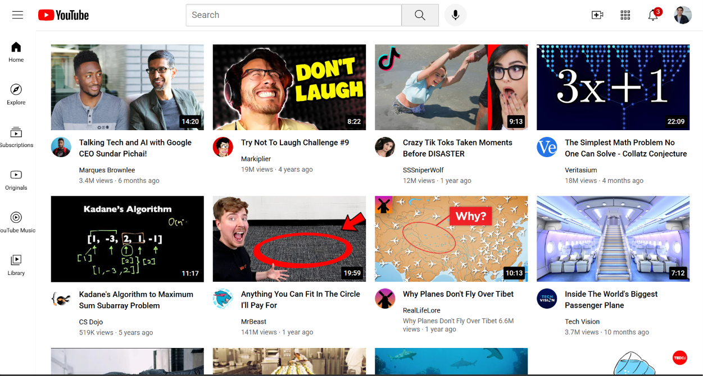

# YouTube Clone

A responsive YouTube homepage clone built using HTML and CSS.

## 🚀 Features

* YouTube-style navigation bar
* Search bar
* Sidebar navigation
* Video thumbnail grid
* Channel profile pictures
* Responsive layout
* Clean and structured CSS

## 🛠️ Technologies Used

* HTML5
* CSS3

## 📂 Project Structure

```text
YouTube-Clone/
├── channel-pictures/
├── icons/
├── styles/
├── thumbnails/
├── youtube.html
└── README.md
```

## ▶️ How to Run

1. Clone this repository.
2. Open the project folder.
3. Open `youtube.html` in a web browser.

## 🎯 Purpose

This project was created to practice HTML and CSS by recreating the layout and visual structure of the YouTube homepage.

## 📸 Preview

## 📸 Preview



## 👨‍💻 Author

Shiva Erranagi
